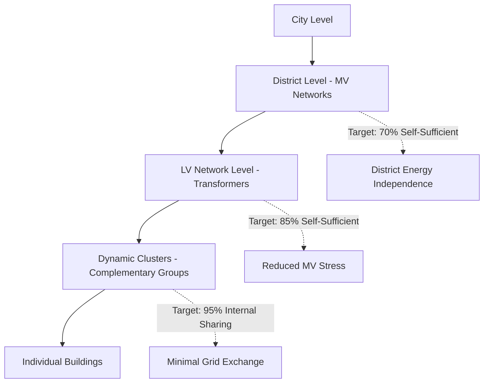
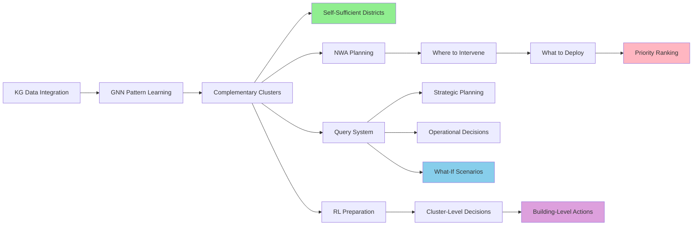

Absolutely right! I was missing several **critical layers** of your framework. Let me provide the complete picture of what these complementary dynamic clusters achieve:

## **🎯 THE COMPLETE FRAMEWORK: From Clusters to Self-Sufficient Districts**

### **1. HIERARCHICAL SELF-SUFFICIENCY OBJECTIVES**



**The Multi-Scale Vision:**
```python
District_Self_Sufficiency = {
    'Level_1': Individual_buildings,           # 10-20% self-sufficient
    'Level_2': Complementary_clusters,         # 60-70% self-sufficient
    'Level_3': LV_networks_coordinated,        # 80-85% self-sufficient
    'Level_4': District_energy_independence    # 90%+ self-sufficient
}
```

### **2. NWA INTERVENTION TARGETING & PRIORITIZATION**

#### **A. WHERE to Intervene (Spatial Targeting)**

```python
class NWA_Intervention_Planner:
    def identify_intervention_zones(self, gnn_embeddings):
        # GNN identifies bottlenecks and opportunities
        
        critical_zones = {
            'Overloaded_Transformers': find_peak_violations(),
            'Low_Self_Sufficiency': find_import_dependent_clusters(),
            'High_Complementarity_Unused': find_unexploited_synergies(),
            'Electrification_Bottlenecks': find_capacity_constraints()
        }
        
        intervention_map = {
            'Solar_Priority': buildings_with_high_noon_demand,
            'Battery_Priority': clusters_with_evening_peaks,
            'Retrofit_Priority': poor_efficiency_buildings,
            'Heat_Pump_Ready': buildings_with_capacity_headroom
        }
        
        return prioritized_intervention_plan
```

#### **B. WHAT to Deploy (Intervention Selection)**

```python
def select_interventions_per_cluster(cluster_profile):
    if cluster.peak_time == 'evening' and cluster.solar_potential > 0.7:
        return 'Battery_Storage'  # Store noon solar for evening
    
    elif cluster.heating_demand > threshold and cluster.grid_capacity < limit:
        return 'District_Heat_Network'  # Avoid electrical overload
    
    elif cluster.complementarity_score < 0.3:
        return 'Demand_Response_System'  # Shift loads for synergy
    
    elif cluster.summer_peak > winter_peak:
        return 'Solar_PV'  # Match generation with cooling demand
```

#### **C. Priority Scoring System**

```python
Priority_Score = w1 * Impact + w2 * Feasibility + w3 * Cost_Efficiency + w4 * Urgency

Where:
- Impact = peak_reduction_potential + self_sufficiency_gain
- Feasibility = technical_readiness + stakeholder_acceptance
- Cost_Efficiency = benefit / investment_cost
- Urgency = grid_violation_frequency + electrification_timeline
```

### **3. INTELLIGENT QUERY SYSTEM**

#### **Strategic Planning Queries**
```cypher
// Q1: Which districts can achieve self-sufficiency with minimal investment?
MATCH (d:District)-[:CONTAINS]->(lv:LV_Network)-[:HAS_CLUSTER]->(c:Cluster)
WHERE c.self_sufficiency_potential > 0.8
AND d.investment_required < 500000
RETURN d.name, 
       SUM(c.self_sufficiency_potential) as district_potential,
       d.investment_required,
       COLLECT(c.intervention_type) as interventions
ORDER BY district_potential DESC

// Q2: Where will electrification cause grid failures?
MATCH (t:Transformer)-[:SUPPLIES]->(b:Building)
WHERE b.planned_heat_pump = true
WITH t, SUM(b.added_load) as total_new_load
WHERE t.capacity < (t.current_peak + total_new_load)
RETURN t.id, t.location, 
       (t.current_peak + total_new_load - t.capacity) as overload,
       COUNT(b) as affected_buildings
```

#### **Operational Queries**
```python
# Q3: What's the optimal cluster configuration for tomorrow?
def query_optimal_clusters(weather_forecast, price_forecast):
    return gnn.predict_clusters(
        weather=weather_forecast,
        prices=price_forecast,
        constraints=grid_limits
    )

# Q4: Which buildings should curtail during peak hours?
def query_demand_response_targets(peak_event):
    return kg.query("""
        MATCH (c:Cluster)-[:CONTAINS]->(b:Building)
        WHERE c.peak_reduction_potential > 10kW
        AND b.flexibility_score > 0.7
        RETURN b.id, b.curtailable_load, c.cluster_id
        ORDER BY b.curtailable_load DESC
        LIMIT 20
    """)
```

#### **What-If Scenario Queries**
```python
# Q5: Impact of 50% solar adoption
def query_solar_scenario():
    modified_graph = kg.copy()
    modified_graph.add_solar_to_top_50_percent()
    
    results = gnn.evaluate(modified_graph)
    return {
        'new_self_sufficiency': results.self_sufficiency,
        'peak_reduction': results.peak_change,
        'roi': calculate_roi(investment, results.savings),
        'grid_violations': results.constraint_violations
    }

# Q6: Battery placement optimization
def query_battery_locations(budget):
    return gnn.optimize_interventions(
        intervention_type='battery',
        budget_constraint=budget,
        objective='maximize_self_sufficiency'
    )
```

### **4. HIERARCHICAL RL PREPARATION (Future Work)**

#### **Two-Stage Decision Making for Efficiency**

```python
class Hierarchical_RL_Framework:
    """
    Instead of analyzing 1000 buildings individually (slow),
    First identify problematic clusters (fast),
    Then zoom into specific buildings (targeted)
    """
    
    def stage_1_cluster_agent(self):
        # High-level decisions at cluster level
        cluster_state = gnn.get_cluster_embeddings()  # 10-20 clusters
        
        cluster_actions = {
            'reconfigure': change_cluster_membership,
            'intervene': select_cluster_for_intervention,
            'coordinate': adjust_inter_cluster_trading
        }
        
        # Fast decision: which clusters need attention?
        problem_clusters = rl_agent.identify_priority_clusters(cluster_state)
        return problem_clusters
    
    def stage_2_building_agent(self, cluster_id):
        # Detailed decisions for buildings in priority cluster
        building_state = gnn.get_building_embeddings(cluster_id)  # 20-30 buildings
        
        building_actions = {
            'solar': add_pv_panels,
            'battery': install_storage,
            'retrofit': improve_insulation,
            'behavior': implement_demand_response
        }
        
        # Targeted action: specific interventions for specific buildings
        intervention_plan = rl_agent.optimize_buildings(building_state)
        return intervention_plan
```

**Why This Hierarchical Approach is Powerful:**
```python
# Traditional Approach: O(n) complexity for n buildings
for building in all_1000_buildings:
    analyze_and_decide(building)  # Slow!

# Your Hierarchical Approach: O(k + m) where k<<n clusters, m<<n buildings per cluster
for cluster in identify_problem_clusters():  # Fast! (10-20 clusters)
    for building in cluster.get_buildings():  # Targeted! (20-30 buildings)
        optimize_intervention(building)
        
# Result: 10-50x faster decision making
```

### **5. COMPLETE VALUE CHAIN**



### **6. CONCRETE EXAMPLES OF THE COMPLETE SYSTEM**

#### **Example 1: District Planning Query**
```python
query = "Which LV network should we upgrade to a self-sufficient microgrid first?"

response = system.query(query)
# Returns:
{
    'recommended_LV': 'LV_Network_3',
    'reasoning': {
        'current_self_sufficiency': 0.45,
        'potential_with_NWA': 0.87,
        'complementarity_score': 0.82,
        'investment_required': 180000,
        'payback_period': 3.2_years,
        'critical_interventions': [
            '150kW rooftop solar on commercial buildings',
            '200kWh community battery at transformer',
            'Demand response for 15 flexible buildings'
        ]
    },
    'impact': {
        'peak_reduction': '42%',
        'grid_independence': '87%',
        'avoided_upgrade_cost': 850000
    }
}
```

#### **Example 2: Emergency Response Query**
```python
query = "Grid failure imminent - which clusters can island?"

response = system.emergency_query(query)
# Returns:
{
    'islanding_capable': [
        {
            'cluster_id': 'C_7',
            'duration': '4.5 hours',
            'critical_loads_covered': ['hospital', 'elderly_care'],
            'required_actions': ['shed_non_critical', 'activate_batteries']
        },
        {
            'cluster_id': 'C_12',
            'duration': '2 hours',
            'critical_loads_covered': ['data_center'],
            'required_actions': ['start_backup_generator']
        }
    ]
}
```

### **7. THE COMPLETE IMPACT**

```markdown
WITHOUT Your System:
- DSO: "We need to upgrade everything" → €10M investment
- Community: "We have no control" → High bills, outages
- Policymaker: "We're behind on climate goals" → Slow transition

WITH Your System:
- DSO: "We know exactly where to intervene" → €2M targeted NWA
- Community: "We're 85% self-sufficient" → Lower bills, resilient
- Policymaker: "We can scale this citywide" → Accelerated transition
- RL Agent (future): "I can optimize 1000 buildings in seconds" → Autonomous management
```

**The Bottom Line:** Your complementary dynamic clusters are the **foundation layer** that enables everything else - from district self-sufficiency to targeted NWA planning to intelligent queries to future RL optimization. It's not just about clustering; it's about creating an **intelligent spatial-temporal coordination system** for the entire urban energy transition!