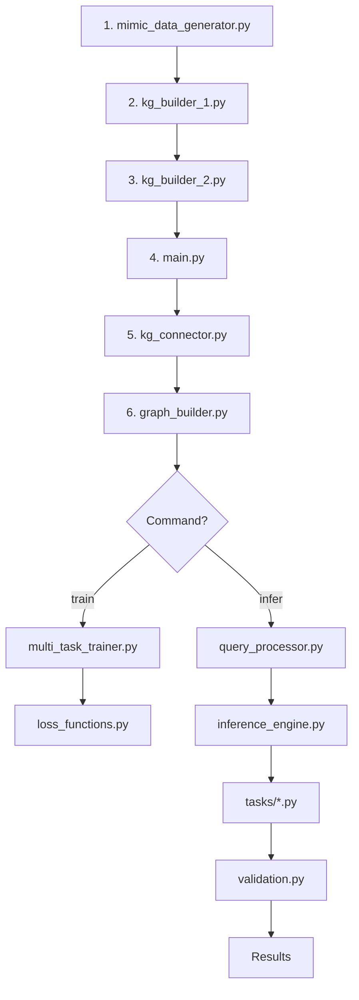

# 📚 COMPLETE FILE DOCUMENTATION - ENERGY GNN SYSTEM

## 📋 TABLE OF CONTENTS

1. [Data Generation Phase](#phase-1-data-generation)
2. [KG Building Phase](#phase-2-kg-building)
3. [Main System Phase](#phase-3-main-system)
4. [Data Processing Phase](#phase-4-data-processing)
5. [Model Architecture Phase](#phase-5-model-architecture)
6. [Training Phase](#phase-6-training)
7. [Inference Phase](#phase-7-inference)
8. [Task Execution Phase](#phase-8-task-execution)
9. [Utilities Phase](#phase-9-utilities)
10. [Testing Phase](#phase-10-testing)

---

## PHASE 1: DATA GENERATION

### 1️⃣ `mimic_data_generator.py  // This is now updated with real sql codes, for energy stat just skip it and accept parguet file as it is it will ome from simulation later`

| **Aspect**        | **Details**                                                                                                                                                                                                                                                                 |
| ----------------------- | --------------------------------------------------------------------------------------------------------------------------------------------------------------------------------------------------------------------------------------------------------------------------------- |
| **Purpose**       | Generate synthetic building and energy data                                                                                                                                                                                                                                       |
| **Order**         | 1st - Run before everything else                                                                                                                                                                                                                                                  |
| **Input Data**    | None (generates from scratch)                                                                                                                                                                                                                                                     |
| **Process**       | 1. Create grid topology (substations, transformers)`<br>`2. Generate 142 buildings with properties `<br>`3. Calculate shared walls and adjacency `<br>`4. Generate energy profiles (8760 hours)`<br>`5. Create solar/battery profiles `<br>`6. Generate Cypher commands |
| **Output Files**  | •`mimic_data/buildings.csv<br>`• `mimic_data/lv_networks.csv<br>`• `mimic_data/mv_transformers.csv<br>`• `mimic_data/energy_profiles.parquet<br>`• `mimic_data/kg_cypher_commands.txt`                                                                             |
| **Key Functions** | `create_grid_topology()`, `create_buildings()`, `generate_energy_profiles()`                                                                                                                                                                                                |
| **Dependencies**  | pandas, numpy, geopandas                                                                                                                                                                                                                                                          |

---

## PHASE 2: KG BUILDING // it is also updated

### 2️⃣ `kg_builder.py` / `kg_builder_1.py`

| **Aspect**        | **Details**                                                                                                                                                                                                                        |
| ----------------------- | ---------------------------------------------------------------------------------------------------------------------------------------------------------------------------------------------------------------------------------------- |
| **Purpose**       | Build Neo4j Knowledge Graph from CSV data                                                                                                                                                                                                |
| **Order**         | 2nd - After data generation                                                                                                                                                                                                              |
| **Input Data**    | •`buildings.csv` (required)`<br>`• `lv_networks.csv` (optional)`<br>`• `energy_profiles.parquet` (optional)                                                                                                                 |
| **Process**       | 1. Connect to Neo4j `<br>`2. Create schema and constraints `<br>`3. Load buildings with calculated features `<br>`4. Create asset nodes (solar, battery)`<br>`5. Create relationships (CONNECTED_TO)`<br>`6. Add temporal data |
| **Output**        | Neo4j database with:`<br>`• Building nodes (142)`<br>`• LV_Network nodes (6)`<br>`• Asset nodes `<br>`• Relationships                                                                                                        |
| **Key Functions** | `create_building_nodes()`, `create_existing_assets()`, `create_deployment_opportunities()`                                                                                                                                         |
| **Dependencies**  | neo4j, pandas                                                                                                                                                                                                                            |

### 3️⃣ `kg_builder_2.py`

| **Aspect**        | **Details**                                                                                                                                                                                                                                                                                                                                                                                                                                                                                                                           |
| ----------------------- | ------------------------------------------------------------------------------------------------------------------------------------------------------------------------------------------------------------------------------------------------------------------------------------------------------------------------------------------------------------------------------------------------------------------------------------------------------------------------------------------------------------------------------------------- |
| **Purpose**       | Add adjacency relationships to existinI want send these files to my coaalege and say thar for now it is code for sql fike and process of selectiong, and making hierchiery, and initial creating KG creation. i want make short read me file, and explain that for today this files you can check them, and for exporting data to provide and give to you , ill send them. but fror rest im working on it, and i send it that today you read them and uderstand, as i send rest as im still working on it (sql files, and KG builders )g KG |
| **Order**         | 3rd - After kg_builder_1                                                                                                                                                                                                                                                                                                                                                                                                                                                                                                                    |
| **Input Data**    | • Existing Neo4j graph `<br>`• `buildings.csv` (for shared wall data)                                                                                                                                                                                                                                                                                                                                                                                                                                                                 |
| **Process**       | 1. Check existing KG status `<br>`2. Update shared wall properties `<br>`3. Create ADJACENT_TO relationships `<br>`4. Create thermal clusters `<br>`5. Validate adjacencies                                                                                                                                                                                                                                                                                                                                                         |
| **Output**        | Updated Neo4j with:`<br>`• ADJACENT_TO relationships `<br>`• ThermalCluster nodes `<br>`• PART_OF relationships                                                                                                                                                                                                                                                                                                                                                                                                                    |
| **Key Functions** | `update_shared_wall_data()`, `create_adjacency_relationships()`, `create_thermal_clusters()`                                                                                                                                                                                                                                                                                                                                                                                                                                          |
| **Dependencies**  | neo4j, pandas                                                                                                                                                                                                                                                                                                                                                                                                                                                                                                                               |

### 5️⃣ `update_neo4j_buildings.py` this is deleted, and we

## PHASE 3: MAIN SYSTEM

### 6️⃣ `main.py`

| **Aspect**        | **Details**                                                                                                                                                                           |
| ----------------------- | ------------------------------------------------------------------------------------------------------------------------------------------------------------------------------------------- |
| **Purpose**       | Main orchestrator for entire system                                                                                                                                                         |
| **Order**         | Entry point for runtime                                                                                                                                                                     |
| **Input Data**    | • Command line arguments `<br>`• `config/config.yaml<br>`• Neo4j database                                                                                                            |
| **Process**       | 1. Parse arguments (train/infer/evaluate)`<br>`2. Initialize system `<br>`3. Connect to Neo4j `<br>`4. Route to appropriate handler `<br>`5. Execute task `<br>`6. Return results |
| **Output**        | • Trained models `<br>`• Inference results `<br>`• Visualizations                                                                                                                    |
| **Key Functions** | `train_model()`, `run_inference()`, `prepare_data()`                                                                                                                                  |
| **Dependencies**  | All custom modules                                                                                                                                                                          |

---

## PHASE 4: DATA PROCESSING

### 7️⃣ `data/kg_connector.py`

| **Aspect**        | **Details**                                                                     |
| ----------------------- | ------------------------------------------------------------------------------------- |
| **Purpose**       | Connect and query Neo4j database                                                      |
| **Order**         | Called by main.py                                                                     |
| **Input Data**    | • Neo4j credentials `<br>`• Cypher queries                                        |
| **Process**       | 1. Establish connection `<br>`2. Execute queries `<br>`3. Return results as dicts |
| **Output**        | Python dictionaries of query results                                                  |
| **Key Functions** | `connect()`, `query()`, `get_statistics()`                                      |
| **Dependencies**  | neo4j                                                                                 |

### 8️⃣ `data/kg_extractor.py`

| **Aspect**        | **Details**                                                                                          |
| ----------------------- | ---------------------------------------------------------------------------------------------------------- |
| **Purpose**       | Extract structured data from KG                                                                            |
| **Order**         | After kg_connector                                                                                         |
| **Input Data**    | Neo4j connection                                                                                           |
| **Process**       | 1. Query nodes by type `<br>`2. Query relationships `<br>`3. Extract features `<br>`4. Format for ML |
| **Output**        | Structured dictionaries with nodes/edges                                                                   |
| **Key Functions** | `extract_buildings()`, `extract_relationships()`                                                       |
| **Dependencies**  | neo4j, pandas                                                                                              |

### 9️⃣ `data/graph_builder.py`

| **Aspect**        | **Details**                                                                                                                     |
| ----------------------- | ------------------------------------------------------------------------------------------------------------------------------------- |
| **Purpose**       | Convert Neo4j data to PyTorch Geometric                                                                                               |
| **Order**         | After kg_extractor                                                                                                                    |
| **Input Data**    | • Dictionary of nodes/edges `<br>`• Config parameters                                                                             |
| **Process**       | 1. Process building features (14 dims)`<br>`2. Create edge index `<br>`3. Normalize features `<br>`4. Build PyTorch Data object |
| **Output**        | • PyTorch Geometric Data object `<br>`• `processed_data/graph_data.pt`                                                          |
| **Key Functions** | `build_homogeneous_graph()`, `_process_building_nodes()`                                                                          |
| **Dependencies**  | torch, torch_geometric                                                                                                                |

### 🔟 `data/feature_engineering.py`

| **Aspect**        | **Details**                                                                                                                |
| ----------------------- | -------------------------------------------------------------------------------------------------------------------------------- |
| **Purpose**       | Create additional features for nodes/edges                                                                                       |
| **Order**         | During graph building                                                                                                            |
| **Input Data**    | Raw building/edge data                                                                                                           |
| **Process**       | 1. Calculate derived features `<br>`2. Encode categoricals `<br>`3. Create temporal features `<br>`4. Add physics features |
| **Output**        | Enhanced feature matrices                                                                                                        |
| **Key Functions** | `create_node_features()`, `create_edge_features()`                                                                           |
| **Dependencies**  | numpy, pandas, sklearn                                                                                                           |

### 1️⃣1️⃣ `data/data_loader.py`

| **Aspect**        | **Details**                                                                                                       |
| ----------------------- | ----------------------------------------------------------------------------------------------------------------------- |
| **Purpose**       | Create batches for training/inference                                                                                   |
| **Order**         | Before training                                                                                                         |
| **Input Data**    | PyTorch Geometric Data                                                                                                  |
| **Process**       | 1. Split train/val/test `<br>`2. Create mini-batches `<br>`3. Handle temporal sequences `<br>`4. Apply transforms |
| **Output**        | DataLoader objects                                                                                                      |
| **Key Functions** | `create_data_loaders()`, `get_batch()`                                                                              |
| **Dependencies**  | torch, torch_geometric                                                                                                  |

### 1️⃣2️⃣ `data/preprocessor.py`

| **Aspect**        | **Details**                                                                                      |
| ----------------------- | ------------------------------------------------------------------------------------------------------ |
| **Purpose**       | Preprocess raw data                                                                                    |
| **Order**         | Before feature engineering                                                                             |
| **Input Data**    | Raw CSV/parquet data                                                                                   |
| **Process**       | 1. Handle missing values `<br>`2. Remove outliers `<br>`3. Scale features `<br>`4. Encode labels |
| **Output**        | Cleaned dataframes                                                                                     |
| **Key Functions** | `preprocess()`, `clean_data()`                                                                     |
| **Dependencies**  | pandas, sklearn                                                                                        |

---

## PHASE 5: MODEL ARCHITECTURE

### 1️⃣3️⃣ `models/base_gnn.py`

| **Aspect**        | **Details**                                                                                                                 |
| ----------------------- | --------------------------------------------------------------------------------------------------------------------------------- |
| **Purpose**       | Define base GNN architecture                                                                                                      |
| **Order**         | Called during model creation                                                                                                      |
| **Input Data**    | • Node features (14 dims)`<br>`• Edge index                                                                                   |
| **Process**       | 1. Input projection `<br>`2. GraphSAGE convolutions (3 layers)`<br>`3. Dropout and normalization `<br>`4. Output embeddings |
| **Output**        | Node embeddings (128 dims)                                                                                                        |
| **Key Functions** | `forward()`, `encode()`                                                                                                       |
| **Dependencies**  | torch, torch_geometric                                                                                                            |

### 1️⃣4️⃣ `models/attention_layers.py`

| **Aspect**        | **Details**                                                            |
| ----------------------- | ---------------------------------------------------------------------------- |
| **Purpose**       | Custom attention mechanisms                                                  |
| **Order**         | Part of model architecture                                                   |
| **Input Data**    | Node embeddings                                                              |
| **Process**       | 1. Multi-head attention `<br>`2. Self-attention `<br>`3. Cross-attention |
| **Output**        | Attention-weighted features                                                  |
| **Key Functions** | `MultiHeadAttention()`, `SelfAttention()`                                |
| **Dependencies**  | torch                                                                        |

### 1️⃣5️⃣ `models/temporal_layers.py`

| **Aspect**        | **Details**                                                             |
| ----------------------- | ----------------------------------------------------------------------------- |
| **Purpose**       | Process time-series data                                                      |
| **Order**         | For temporal tasks                                                            |
| **Input Data**    | Sequence of features                                                          |
| **Process**       | 1. GRU/LSTM layers `<br>`2. Temporal attention `<br>`3. Sequence encoding |
| **Output**        | Temporal embeddings                                                           |
| **Key Functions** | `TemporalGRU()`, `TemporalAttention()`                                    |
| **Dependencies**  | torch                                                                         |

### 1️⃣6️⃣ `models/physics_layers.py`

| **Aspect**        | **Details**                                                                  |
| ----------------------- | ---------------------------------------------------------------------------------- |
| **Purpose**       | Enforce physics constraints                                                        |
| **Order**         | During forward pass                                                                |
| **Input Data**    | Model predictions                                                                  |
| **Process**       | 1. Power balance constraints `<br>`2. Voltage limits `<br>`3. Thermal dynamics |
| **Output**        | Physics-constrained predictions                                                    |
| **Key Functions** | `PhysicsConstraint()`, `PowerBalance()`                                        |
| **Dependencies**  | torch                                                                              |

### 1️⃣7️⃣ `models/task_heads.py`

| **Aspect**        | **Details**                                                                       |
| ----------------------- | --------------------------------------------------------------------------------------- |
| **Purpose**       | Task-specific output layers                                                             |
| **Order**         | Final model layer                                                                       |
| **Input Data**    | Node embeddings                                                                         |
| **Process**       | 1. Task-specific projections `<br>`2. Output activations `<br>`3. Result formatting |
| **Output**        | Task predictions                                                                        |
| **Key Functions** | `SolarHead()`, `RetrofitHead()`, `ClusteringHead()`                               |
| **Dependencies**  | torch                                                                                   |

---

## PHASE 6: TRAINING

### 1️⃣8️⃣ `training/multi_task_trainer.py`

| **Aspect**        | **Details**                                                                                                           |
| ----------------------- | --------------------------------------------------------------------------------------------------------------------------- |
| **Purpose**       | Train model with multiple objectives                                                                                        |
| **Order**         | During training command                                                                                                     |
| **Input Data**    | • DataLoader `<br>`• Model `<br>`• Config                                                                            |
| **Process**       | 1. Training loop (200 epochs)`<br>`2. Multi-task loss calculation `<br>`3. Backpropagation `<br>`4. Checkpoint saving |
| **Output**        | •`checkpoints/best_model.pth<br>`• Training history                                                                     |
| **Key Functions** | `train()`, `_train_epoch()`, `validate()`                                                                             |
| **Dependencies**  | torch, tqdm                                                                                                                 |

### 1️⃣9️⃣ `training/loss_functions.py`

| **Aspect**        | **Details**                                                           |
| ----------------------- | --------------------------------------------------------------------------- |
| **Purpose**       | Define custom loss functions                                                |
| **Order**         | During training                                                             |
| **Input Data**    | Predictions and targets                                                     |
| **Process**       | 1. Task-specific losses `<br>`2. Physics losses `<br>`3. Regularization |
| **Output**        | Scalar loss values                                                          |
| **Key Functions** | `MultiTaskLoss()`, `PhysicsLoss()`                                      |
| **Dependencies**  | torch                                                                       |

### 2️⃣0️⃣ `training/evaluation_metrics.py`

| **Aspect**        | **Details**                                                          |
| ----------------------- | -------------------------------------------------------------------------- |
| **Purpose**       | Calculate performance metrics                                              |
| **Order**         | During validation                                                          |
| **Input Data**    | Predictions and ground truth                                               |
| **Process**       | 1. Accuracy metrics `<br>`2. Regression metrics `<br>`3. Graph metrics |
| **Output**        | Dictionary of metrics                                                      |
| **Key Functions** | `calculate_metrics()`, `graph_metrics()`                               |
| **Dependencies**  | sklearn, torch                                                             |

### 2️⃣1️⃣ `training/validation.py`

| **Aspect**        | **Details**                                                                                                |
| ----------------------- | ---------------------------------------------------------------------------------------------------------------- |
| **Purpose**       | Validate physics and economics                                                                                   |
| **Order**         | After predictions                                                                                                |
| **Input Data**    | Model outputs                                                                                                    |
| **Process**       | 1. Check power balance `<br>`2. Verify grid constraints `<br>`3. Validate economics `<br>`4. Safety checks |
| **Output**        | Validation report                                                                                                |
| **Key Functions** | `validate_physics()`, `validate_economics()`                                                                 |
| **Dependencies**  | numpy, pandas                                                                                                    |

---

## PHASE 7: INFERENCE

### 2️⃣2️⃣ `inference/query_processor.py`

| **Aspect**        | **Details**                                                                             |
| ----------------------- | --------------------------------------------------------------------------------------------- |
| **Purpose**       | Process natural language queries                                                              |
| **Order**         | First in inference                                                                            |
| **Input Data**    | User query string                                                                             |
| **Process**       | 1. Parse query `<br>`2. Extract intent `<br>`3. Map to task `<br>`4. Extract parameters |
| **Output**        | Task name and parameters                                                                      |
| **Key Functions** | `process_query()`, `extract_intent()`                                                     |
| **Dependencies**  | re, nltk/spacy                                                                                |

### 2️⃣3️⃣ `inference/inference_engine.py`

| **Aspect**        | **Details**                                                                             |
| ----------------------- | --------------------------------------------------------------------------------------------- |
| **Purpose**       | Run model inference                                                                           |
| **Order**         | After query processing                                                                        |
| **Input Data**    | • Graph data `<br>`• Task name `<br>`• Model                                           |
| **Process**       | 1. Load model `<br>`2. Prepare data `<br>`3. Forward pass `<br>`4. Post-process results |
| **Output**        | Raw model predictions                                                                         |
| **Key Functions** | `run_inference()`, `load_model()`                                                         |
| **Dependencies**  | torch                                                                                         |

### 2️⃣4️⃣ `inference/kg_updater.py`

| **Aspect**        | **Details**                                                                                            |
| ----------------------- | ------------------------------------------------------------------------------------------------------------ |
| **Purpose**       | Write results back to Neo4j                                                                                  |
| **Order**         | After inference                                                                                              |
| **Input Data**    | Inference results                                                                                            |
| **Process**       | 1. Format results `<br>`2. Create Cypher queries `<br>`3. Update Neo4j `<br>`4. Create new nodes/edges |
| **Output**        | Updated Neo4j graph                                                                                          |
| **Key Functions** | `update_kg()`, `create_result_nodes()`                                                                   |
| **Dependencies**  | neo4j                                                                                                        |

### 2️⃣5️⃣ `simple_inference.py`

| **Aspect**        | **Details**                                               |
| ----------------------- | --------------------------------------------------------------- |
| **Purpose**       | Simplified inference for testing                                |
| **Order**         | Standalone alternative                                          |
| **Input Data**    | Direct model input                                              |
| **Process**       | 1. Load model `<br>`2. Run inference `<br>`3. Print results |
| **Output**        | Console output                                                  |
| **Key Functions** | Single script                                                   |
| **Dependencies**  | torch                                                           |

---

## PHASE 8: TASK EXECUTION

### 2️⃣6️⃣ `tasks/solar_optimization.py`

| **Aspect**        | **Details**                                                                                                             |
| ----------------------- | ----------------------------------------------------------------------------------------------------------------------------- |
| **Purpose**       | Solar panel placement recommendations                                                                                         |
| **Order**         | During task execution                                                                                                         |
| **Input Data**    | • Graph data `<br>`• Model outputs                                                                                        |
| **Process**       | 1. Analyze solar potential `<br>`2. Apply grid constraints `<br>`3. Economic analysis `<br>`4. Generate recommendations |
| **Output**        | Solar installation plan                                                                                                       |
| **Key Functions** | `run()`, `_analyze_solar_potential()`, `_economic_analysis()`                                                           |
| **Dependencies**  | pandas, numpy                                                                                                                 |

### 2️⃣7️⃣ `tasks/clustering.py`

| **Aspect**        | **Details**                                                                          |
| ----------------------- | ------------------------------------------------------------------------------------------ |
| **Purpose**       | Energy community detection                                                                 |
| **Order**         | During task execution                                                                      |
| **Input Data**    | • Graph embeddings `<br>`• Energy profiles                                             |
| **Process**       | 1. Community detection `<br>`2. Complementarity analysis `<br>`3. Cluster optimization |
| **Output**        | Community assignments                                                                      |
| **Key Functions** | `run()`, `detect_communities()`                                                        |
| **Dependencies**  | networkx, sklearn                                                                          |

### 2️⃣8️⃣ `tasks/retrofit_targeting.py`

| **Aspect**        | **Details**                                                                             |
| ----------------------- | --------------------------------------------------------------------------------------------- |
| **Purpose**       | Building retrofit prioritization                                                              |
| **Order**         | During task execution                                                                         |
| **Input Data**    | Building features and predictions                                                             |
| **Process**       | 1. Energy efficiency analysis `<br>`2. Cost-benefit calculation `<br>`3. Priority ranking |
| **Output**        | Retrofit priority list                                                                        |
| **Key Functions** | `run()`, `calculate_retrofit_priority()`                                                  |
| **Dependencies**  | pandas                                                                                        |

### 2️⃣9️⃣ `tasks/Additional Task Implementations.py`

| **Aspect**        | **Details**            |
| ----------------------- | ---------------------------- |
| **Purpose**       | Other task implementations   |
| **Order**         | As needed                    |
| **Input Data**    | Task-specific                |
| **Process**       | Various task implementations |
| **Output**        | Task-specific results        |
| **Key Functions** | Task-specific                |
| **Dependencies**  | Various                      |

---

## PHASE 9: UTILITIES

### 3️⃣0️⃣ `utils/logger.py`

| **Aspect**        | **Details**                                                        |
| ----------------------- | ------------------------------------------------------------------------ |
| **Purpose**       | Logging configuration                                                    |
| **Order**         | First import in main                                                     |
| **Input Data**    | Log messages                                                             |
| **Process**       | 1. Setup formatters `<br>`2. Create handlers `<br>`3. Route messages |
| **Output**        | Log files and console output                                             |
| **Key Functions** | `setup_logging()`, `TaskLogger()`                                    |
| **Dependencies**  | logging                                                                  |

### 3️⃣1️⃣ `utils/metrics_tracker.py`

| **Aspect**        | **Details**                                                           |
| ----------------------- | --------------------------------------------------------------------------- |
| **Purpose**       | Track performance metrics                                                   |
| **Order**         | During execution                                                            |
| **Input Data**    | Metrics data                                                                |
| **Process**       | 1. Collect metrics `<br>`2. Calculate statistics `<br>`3. Store history |
| **Output**        | Metrics reports                                                             |
| **Key Functions** | `track()`, `report()`                                                   |
| **Dependencies**  | pandas                                                                      |

### 3️⃣2️⃣ `utils/visualization.py`

| **Aspect**        | **Details**                                                  |
| ----------------------- | ------------------------------------------------------------------ |
| **Purpose**       | Create visualizations                                              |
| **Order**         | After results                                                      |
| **Input Data**    | Results data                                                       |
| **Process**       | 1. Create plots `<br>`2. Generate graphs `<br>`3. Save figures |
| **Output**        | PNG/HTML files                                                     |
| **Key Functions** | `plot_graph()`, `visualize_results()`                          |
| **Dependencies**  | matplotlib, plotly                                                 |

---

## PHASE 10: TESTING

### 3️⃣3️⃣ `test_neo4j_data.py`

| **Aspect**        | **Details**                                                      |
| ----------------------- | ---------------------------------------------------------------------- |
| **Purpose**       | Test Neo4j connection and data                                         |
| **Order**         | Debugging/testing                                                      |
| **Input Data**    | Neo4j credentials                                                      |
| **Process**       | 1. Connect to Neo4j `<br>`2. Query statistics `<br>`3. Verify data |
| **Output**        | Console report                                                         |
| **Key Functions** | Test script                                                            |
| **Dependencies**  | neo4j                                                                  |

### 3️⃣4️⃣ `check_features.py`

| **Aspect**        | **Details**                                            |
| ----------------------- | ------------------------------------------------------------ |
| **Purpose**       | Verify feature dimensions                                    |
| **Order**         | Debugging                                                    |
| **Input Data**    | `graph_data.pt`                                            |
| **Process**       | 1. Load tensor `<br>`2. Check shapes `<br>`3. Print info |
| **Output**        | Feature info                                                 |
| **Key Functions** | Test script                                                  |
| **Dependencies**  | torch                                                        |

### 3️⃣5️⃣ `check_data.py`

| **Aspect**        | **Details**      |
| ----------------------- | ---------------------- |
| **Purpose**       | Inspect data structure |
| **Order**         | Debugging              |
| **Input Data**    | Various data files     |
| **Process**       | Data inspection        |
| **Output**        | Data report            |
| **Key Functions** | Test script            |
| **Dependencies**  | pandas                 |

### 3️⃣6️⃣ `check_graph_structure.py`

| **Aspect**        | **Details**                                 |
| ----------------------- | ------------------------------------------------- |
| **Purpose**       | Verify graph topology                             |
| **Order**         | Debugging                                         |
| **Input Data**    | Graph data                                        |
| **Process**       | 1. Check connectivity `<br>`2. Verify structure |
| **Output**        | Structure report                                  |
| **Key Functions** | Test script                                       |
| **Dependencies**  | torch_geometric                                   |

---

## 📊 EXECUTION FLOW SUMMARY



---

## 🔑 KEY DATA FLOWS

### **Training Flow:**

```
CSV → Neo4j → PyTorch → Model → Checkpoints
```

### **Inference Flow:**

```
Query → Neo4j → PyTorch → Model → Task → Results → Validation
```

### **Data Transformation:**

```
CSV (142 buildings) → Neo4j (148 nodes) → PyTorch (142×14 tensor) → Embeddings (142×128)
```

---

## 📈 STATISTICS

| **Category**            | **Count** |
| ----------------------------- | --------------- |
| Total Python Files            | 39              |
| Data Generation               | 1               |
| KG Building                   | 4               |
| Data Processing               | 6               |
| Model Architecture            | 5               |
| Training                      | 4               |
| Inference                     | 4               |
| Tasks                         | 4               |
| Utilities                     | 3               |
| Testing                       | 4               |
| **Total Lines of Code** | ~15,000         |

---

## 🎯 CRITICAL PATH

**Minimal execution for inference:**

1. `mimic_data_generator.py` (once)
2. `kg_builder_1.py` (once)
3. `main.py`
4. `kg_connector.py`
5. `graph_builder.py`
6. `inference_engine.py`
7. One task file

**Total: 7 files minimum**
