# GRAPH SCHEMA VISUALIZATION
## Energy District Knowledge Graph

```mermaid
graph TB
    %% Style definitions
    classDef building fill:#e8f4fd,stroke:#2196F3,stroke-width:3px
    classDef grid fill:#fff3e0,stroke:#ff9800,stroke-width:3px
    classDef asset fill:#e8f5e9,stroke:#4caf50,stroke-width:3px
    classDef temporal fill:#fce4ec,stroke:#e91e63,stroke-width:3px
    classDef cluster fill:#f3e5f5,stroke:#9c27b0,stroke-width:3px
    classDef meta fill:#e0e0e0,stroke:#757575,stroke-width:2px

    %% NODES
    
    %% Buildings & Infrastructure
    Building[["🏢 Building<br/>━━━━━━━━━━<br/>• ogc_fid<br/>• x, y coordinates<br/>• building_function<br/>• area, height<br/>• energy_label<br/>• has_solar/battery/hp<br/>• lv_group_id<br/>• connection_type<br/>• adjacency_type<br/>• shared_wall_lengths"]]:::building
    
    Substation[["⚡ Substation<br/>━━━━━━━━━━<br/>• station_id<br/>• voltage: HV<br/>• x, y location"]]:::grid
    
    Transformer[["🔌 Transformer<br/>━━━━━━━━━━<br/>• transformer_id<br/>• voltage: MV→LV<br/>• x, y location"]]:::grid
    
    LVCabinet[["📦 LV Cabinet<br/>━━━━━━━━━━<br/>• cabinet_id<br/>• voltage: LV<br/>• x, y location"]]:::grid
    
    CableGroup[["🔗 Cable Group<br/>━━━━━━━━━━<br/>• group_id<br/>• voltage_level<br/>• segment_count<br/>• total_length_m<br/>• baseline_metrics"]]:::grid
    
    CableSegment[["〰️ Cable Segment<br/>━━━━━━━━━━<br/>• segment_id<br/>• voltage_level<br/>• length_m<br/>• start/end points"]]:::grid
    
    ConnectionPoint[["📍 Connection Point<br/>━━━━━━━━━━<br/>• point_id<br/>• building_id<br/>• segment_id<br/>• distance_along"]]:::grid
    
    %% Assets
    SolarSystem[["☀️ Solar System<br/>━━━━━━━━━━<br/>• system_id<br/>• status: existing/potential<br/>• capacity_kwp<br/>• orientation_efficiency"]]:::asset
    
    BatterySystem[["🔋 Battery System<br/>━━━━━━━━━━<br/>• system_id<br/>• status: existing/potential<br/>• capacity_kwh<br/>• power_rating_kw"]]:::asset
    
    HeatPumpSystem[["♨️ Heat Pump<br/>━━━━━━━━━━<br/>• system_id<br/>• status: existing/potential<br/>• expected_cop<br/>• heating_capacity_kw"]]:::asset
    
    %% Temporal
    TimeSlot[["🕐 Time Slot<br/>━━━━━━━━━━<br/>• slot_id<br/>• timestamp<br/>• hour_of_day<br/>• season"]]:::temporal
    
    EnergyState[["📊 Energy State<br/>━━━━━━━━━━<br/>• state_id<br/>• demand_kw<br/>• generation_kw<br/>• net_position<br/>• battery_soc"]]:::temporal
    
    %% Clustering
    AdjacencyCluster[["🏘️ Adjacency Cluster<br/>━━━━━━━━━━<br/>• cluster_id<br/>• cluster_type<br/>• member_count<br/>• energy_sharing_potential"]]:::cluster
    
    %% RELATIONSHIPS
    
    %% Grid connections
    Building -.->|"CONNECTED_TO<br/>• distance_m<br/>• connection_type"| CableGroup
    Building -->|"HAS_CONNECTION_POINT"| ConnectionPoint
    ConnectionPoint -->|"ON_SEGMENT<br/>• fraction<br/>• distance_along"| CableSegment
    CableSegment -->|"PART_OF"| CableGroup
    
    %% Grid hierarchy
    CableGroup -.->|"FEEDS_FROM<br/>• via_station<br/>• confidence"| CableGroup
    CableGroup -.->|"CONNECTS_TO<br/>• connection_type<br/>• distance_m"| Transformer
    CableGroup -.->|"CONNECTS_TO"| Substation
    CableGroup -.->|"CONNECTS_TO"| LVCabinet
    
    %% Asset relationships
    Building ==>|"HAS_INSTALLED<br/>• install_date"| SolarSystem
    Building ==>|"HAS_INSTALLED"| BatterySystem
    Building ==>|"HAS_INSTALLED"| HeatPumpSystem
    Building -.->|"CAN_INSTALL<br/>• feasibility_score"| SolarSystem
    Building -.->|"CAN_INSTALL"| BatterySystem
    Building -.->|"SHOULD_ELECTRIFY<br/>• priority<br/>• expected_cop"| HeatPumpSystem
    
    %% Temporal relationships
    Building -->|"HAS_STATE_AT"| EnergyState
    EnergyState -->|"DURING"| TimeSlot
    
    %% Adjacency relationships
    Building <-.->|"ADJACENT_TO<br/>• wall_pair<br/>• shared_length<br/>• complementarity"| Building
    Building -->|"IN_ADJACENCY_CLUSTER<br/>• role"| AdjacencyCluster
    Building -.->|"NEAR_MV<br/>• distance_m"| CableGroup
```



## Legend & Key Concepts

### Node Categories
- **🏢 BUILDINGS**: Core entities with energy consumption/generation
- **⚡ GRID INFRASTRUCTURE**: Electrical distribution components (HV→MV→LV)
- **🌱 ENERGY ASSETS**: Solar, battery, heat pump systems (existing & potential)
- **📊 TEMPORAL**: Time-series energy states and time slots
- **🏘️ CLUSTERS**: Natural groupings based on adjacency

### Relationship Types
- **Solid lines (→)**: Direct physical or ownership connections
- **Dashed lines (-.->)**: Potential or logical connections
- **Double lines (==>)**: Strong asset installations
- **Bidirectional (<-.->)**: Mutual relationships (adjacency)

### Voltage Hierarchy
```
HV (High Voltage) 
    ↓ [via Substations]
MV (Medium Voltage)
    ↓ [via Transformers]  
LV (Low Voltage)
    ↓ [via Cables]
Buildings
```

### Key Features
1. **Multi-level Grid Topology**: Complete electrical infrastructure from substations to buildings
2. **Adjacency Relationships**: Building-to-building connections for energy sharing potential
3. **Temporal Dynamics**: Time-series energy states for consumption/generation patterns
4. **Asset Deployment**: Both existing installations and potential opportunities
5. **Natural Clustering**: Row houses, apartment complexes, corner blocks

### Data Flow
1. **PostgreSQL Source**: Grid infrastructure and building data from `amin_grid` schema
2. **Pre-GNN State**: Raw infrastructure and potential opportunities
3. **Post-GNN Enhancement**: Complementarity scores and optimal clustering (to be added)

This schema represents the foundation for GNN-based optimization of energy communities, enabling analysis of:
- Energy sharing potential between adjacent buildings
- Optimal placement of solar, battery, and heat pump systems
- Load balancing across LV groups
- Peak demand reduction through complementarity
- Natural energy community formation


